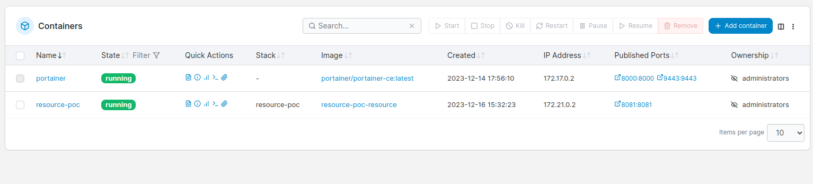

# spring-docker-jenkins-poc

A POC Project that intends to run a spring project inside a java 17 docker container, exposing a port for the API.

### **Main Objectives:**
* Configure the Jenkins server on your machine;
  * To make Jenkins use the jdk 17 it **must** be the default from the machine.
* Understand the difference between Jenkins Controller & Agents;
* Set the Jenkinsfile to:
  * Gradle Clean & Build;
  * Docker compose build:
    * Pass an .env file, register as a secret file on jenkins server;
  * Docker compose run

From [Jenkins Official](https://www.jenkins.io/doc/book/using/using-agents/):

`"The Jenkins controller is the original node in the Jenkins installation. The Jenkins controller administers the Jenkins agents and orchestrates their work, including scheduling jobs on agents and monitoring agents. Agents may be connected to the Jenkins controller using either local or cloud computers."`

### Portainer

Resource-poc docker container running after jenkins pipeline execution.

