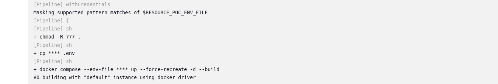

# spring-docker-jenkins-poc

A POC Project that intends to run a spring project inside a java 17 docker container, exposing a port for the API.

### **Main Objectives:**
* Configure the Jenkins server on your machine;
  * To make Jenkins use the jdk 17 it **must** be the default from the host machine.
* Understand the difference between Jenkins Controller & Agents;
* Set the Jenkinsfile to:
  * Gradle Clean & Build;
  * Docker compose build:
    * Pass an .env file, register as a secret file on jenkins server;
  * Docker compose run

From [Jenkins Official](https://www.jenkins.io/doc/book/using/using-agents/):

`"The Jenkins controller is the original node in the Jenkins installation. The Jenkins controller administers the Jenkins agents and orchestrates their work, including scheduling jobs on agents and monitoring agents. Agents may be connected to the Jenkins controller using either local or cloud computers."`

### Portainer

Resource-poc docker container running after jenkins pipeline execution.

### Jenkins Secret Files
It's a good practice to store your application secret variables on a .env file, and not expose those variables directly on code.

The Docker Compose file on this project uses a .env file passed on the --env-file flag during the **_Docker Build & Up_**
jenkins stage.

To set up a secret file on jenkins follow the steps provided at [Jenkins Doc](https://www.jenkins.io/doc/book/using/using-credentials/).

### Docker Build & Up Stage

This Jenkins stage has one step, which uses the withCredentials tag to access to previously secret file added directly on Jenkins host.

When jenkins run the command:

`docker compose --env-file $RESOURCE_POC_ENV_FILE up --force-recreate -d --build`

it will try to search the secret file inside the current workspace, which is the root folder from the project:

`~/spring-docker-jenkins-poc/`

Before running the command, we must :
  * Give Jenkins user write access to the project folder (this step could be done inside the Jenkins UI)
    * `chmod -R 777 .`
  * and then copy to .env file to the workspace, so docker compose could access it.
    * `cp $RESOURCE_POC_ENV_FILE .env`

Note that jenkins create those files and does not expose them on the pipeline. We only need to know the varible
**$RESOURCE_POC_ENV_FILE** is the **PATH** to the secret file.

